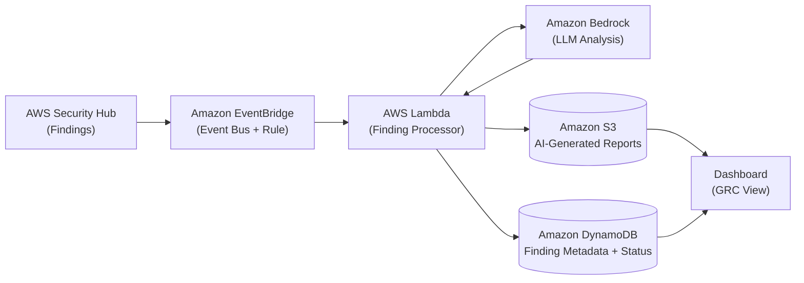

# Architecture

## How it works

1. **AWS Security Hub** aggregates compliance and security findings from across the AWS account and emits them as events.

2. **Amazon EventBridge** captures `Security Hub Findings - Imported` events and routes them via an event rule to the processing layer.

3. **AWS Lambda** receives each finding, normalizes the payload, and orchestrates the rest of the pipeline.

4. **Amazon Bedrock** is invoked by Lambda to generate plain-language explanations, risk summaries, and suggested remediation steps for each finding.

5. **Amazon S3** stores the AI-generated narrative reports (Markdown/JSON), while **Amazon DynamoDB** stores structured finding metadata, status, and Bedrock outputs for fast lookup.

6. **Dashboard** reads from S3 and DynamoDB to present an at-a-glance GRC view: open findings, AI summaries, severity trends, and remediation status.

This is a serverless, event-driven proof-of-concept designed to keep operational overhead low while processing findings only when events are generated.
