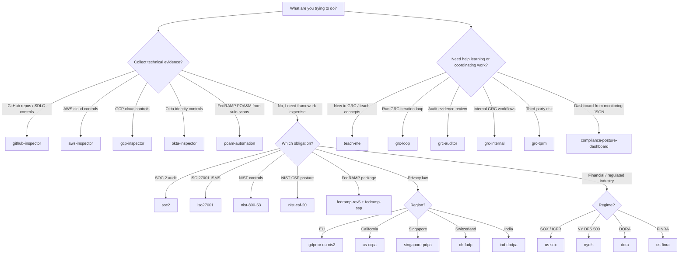

# Quickstart

From zero to your first gap assessment in about 10 minutes. This walkthrough uses GitHub as the data source because you almost certainly already have `gh` CLI authenticated: no cloud credentials required.

## Prerequisites

- [Claude Code](https://docs.claude.com/claude-code) installed (`claude --version` works)
- [`gh` CLI](https://cli.github.com) authenticated (`gh auth status` shows a logged-in user)
- macOS, Linux, or WSL2
- About 10 minutes

Using Claude Cowork instead of Claude Code? See
[`docs/CLAUDE-COWORK.md`](CLAUDE-COWORK.md). Cowork can use the repository's
Markdown, skills, schemas, and `grc-data/` records directly, but plugin
installation and connector collection still need Claude Code or another
terminal-backed environment.

## 1. Install the marketplace

```bash
# Inside Claude Code
/plugin marketplace add GRCEngClub/claude-grc-engineering
```

## 2. Install the core plugins

You need the engineering hub, one connector, and at least one framework plugin.

```bash
/plugin install grc-engineer@grc-engineering-suite
/plugin install github-inspector@grc-engineering-suite
/plugin install soc2@grc-engineering-suite
```

### Which plugin do I need?

Use this quick decision tree when you are not sure what to install next:



A few rules of thumb:

- Start with **`grc-engineer` + one connector + one framework** for technical gap assessment.
- Add more framework plugins when the same evidence must satisfy multiple obligations; the SCF crosswalk lets one connector run support many reports.
- Use **persona plugins** (`grc-auditor`, `grc-internal`, `grc-tprm`) when the task is workflow- or audience-specific rather than framework-specific.
- Use **`teach-me`** before a framework plugin if you need a practitioner primer, role onboarding, or Socratic drills.
- Use **`oscal`** and **`fedramp-ssp`** when the deliverable is OSCAL/FedRAMP package material rather than a markdown gap report.

Confirm with:

```bash
/plugin list
```

## 3. Set up the connector

The connector needs to know where to find the external inspector binary and how to authenticate.

```bash
/github-inspector:setup
```

This command is idempotent. It will:

- Clone `hackIDLE/github-sec-inspector` into `~/.local/share/claude-grc/tools/github-sec-inspector/`
- Verify `gh auth status`
- Write `~/.config/claude-grc/connectors/github-inspector.yaml` with sane defaults
- Run a dry-run health check against your authenticated GitHub account

If `gh` isn't authenticated, you'll get a clear error and remediation steps. No interactive prompts in a script.

## 4. Collect findings

```bash
/github-inspector:collect --scope=my-org
```

Replace `my-org` with an org you own or admin. For a personal account, use `--scope=@me`.

The connector:

- Walks repos, branches, protections, actions settings, code-scanning alerts, deploy keys, webhooks, Dependabot configuration, and secret-scanning state
- Maps each finding to SCF controls (and from there, into every framework via crosswalk)
- Writes the results to `~/.cache/claude-grc/findings/github-inspector/<run_id>.json`
- Prints a one-line summary:

```
github-inspector: 847 resources, 2,341 evaluations, 184 findings (12 high, 47 medium, 125 low).
```

Cached findings are reused by `/gap-assessment` unless you pass `--refresh`.

## 5. Run your first gap assessment

```bash
/grc-engineer:gap-assessment SOC2 --sources=github-inspector
```

You get a markdown report:

```markdown
# Gap Assessment: 2026-04-13

Frameworks: SOC 2 (Security, Availability, Confidentiality)
Sources: github-inspector (1 connector, 847 resources)
Crosswalk: SCF v2026.1 (1,468 controls × 249 frameworks)

## Coverage
SOC 2:  76% (48/63 controls evaluated)
        - Security TSC:       81% (34/42)
        - Availability:       67% (8/12)
        - Confidentiality:    67% (6/9)

## Tier 1 blockers (must resolve before audit)

| Control | Failing resources | Effort | Remediation |
|---------|-------------------|--------|-------------|
| CC6.1   | 23 repos lacking branch protection on main | 2h | `/grc-engineer:generate-implementation` |
| CC7.2   | 14 repos without code scanning enabled | 3h | GitHub Advanced Security |
| CC6.8   | 8 repos with overly permissive deploy keys | 1h | Rotate + reduce scope |

## Tier 2 gaps
... (47 items)

## Passed controls
... (48 items)

Full report saved to ./gap-assessment-2026-04-13.md
Remediation bundle: ./gap-assessment-2026-04-13/remediation/
```

## 6. Explore what you can do next

**Turn a finding into Terraform**:

```bash
/grc-engineer:generate-implementation branch_protection aws
```

**Add another framework without re-collecting**:

```bash
/grc-engineer:gap-assessment SOC2,ISO-27001-2022,NIST-800-53-r5 --sources=github-inspector
```

Cached findings are reused; only the crosswalk join re-runs.

**See the same control across every framework**:

```bash
/grc-engineer:map-controls-unified CC6.1
```

**Add AWS to the picture**:

```bash
/plugin install aws-inspector@grc-engineering-suite
/aws-inspector:setup
/aws-inspector:collect --profile=default --region=us-east-1
/grc-engineer:gap-assessment SOC2,FedRAMP-Moderate --sources=github-inspector,aws-inspector
```

**Schedule it**:

```bash
/grc-engineer:monitor-continuous SOC2 daily --sources=github-inspector,aws-inspector --slack-webhook=$SLACK_URL
```

## Troubleshooting

**`/github-inspector:setup` fails with "gh not authenticated"**
Run `gh auth login`, then re-run setup.

**`/github-inspector:collect` returns few findings**
The connector only evaluates resources you can see with your `gh` token. For org-wide scans, your token needs `admin:org` scope.

**`/gap-assessment` says a framework has no coverage**
Your connectors may not emit evaluations for that framework's controls. Either add a connector with broader coverage (e.g., `aws-inspector` for FedRAMP) or check `/grc-engineer:pipeline-status` to see which frameworks each connector covers.

**Network errors fetching SCF crosswalks**
The toolkit fetches SCF data from `https://grcengclub.github.io/scf-api/` on first use and caches locally. If GitHub Pages is unreachable, set `CLAUDE_GRC_SCF_CACHE=~/path/to/scf-snapshot/` to use a local copy.

## What's next

- [`docs/ARCHITECTURE.md`](ARCHITECTURE.md): how the pipeline fits together
- [`docs/CONTRIBUTING.md`](CONTRIBUTING.md): add your own connector
- [`schemas/finding.schema.json`](../schemas/finding.schema.json): the data contract
