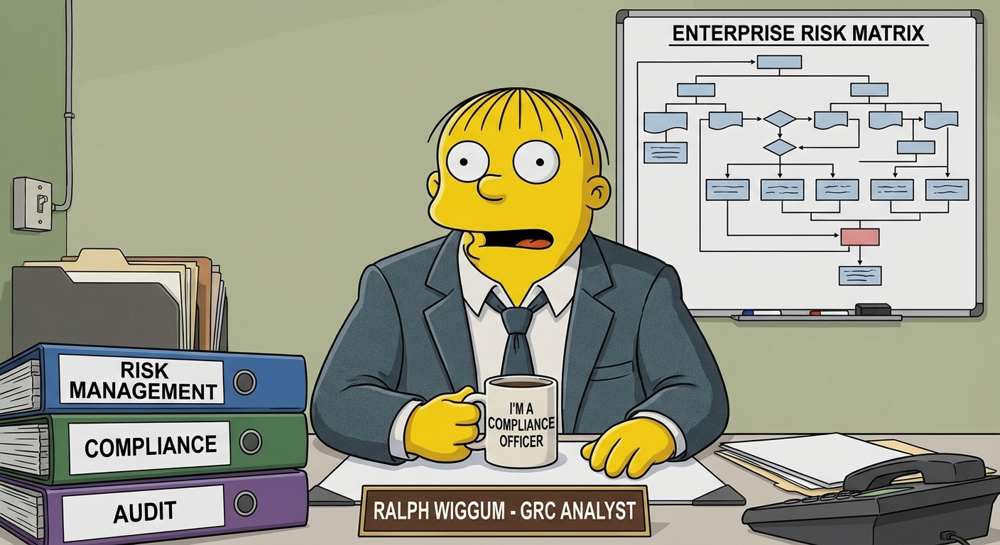

# grc-loop

<p align="center">
  
</p>

Ralph Wiggum's loop, specialized for GRC.

The [ralph-loop technique](https://ghuntley.com/ralph/) — feed Claude the same prompt repeatedly, let the repo state be the memory, stop on a completion promise — turns out to fit GRC work unusually well. Auditors already think in lists: open findings, uncollected evidence, vendors awaiting assessment, POA&M items. Each iteration reduces the list by one. Each iteration has a verifiable pass/fail signal.

This plugin forks ralph-loop's mechanism and ships GRC-specific prompt templates that drive `/grc-engineer:*` commands.

## Targets in v0.1

| Command | What it does | Default cap |
|---|---|---|
| `/grc-loop:gap-burndown <framework>` | Loops `gap-assessment` + `generate-implementation` until zero severity-HIGH findings remain | 20 iterations |
| `/grc-loop:evidence-sweep <framework>` | Loops `collect-evidence` over in-scope controls until every one has a quarterly manifest | 80 iterations |

Operations: `/grc-loop:cancel`, `/grc-loop:help`.

## How it works

Same as ralph-loop. The setup script writes `.claude/grc-loop.local.md` with the prompt body and target metadata. A `Stop` hook intercepts session exit, checks the state file for a completion promise in the last assistant message, and if not found, blocks exit and re-feeds the prompt as `decision: "block"` with `reason: <prompt>`.

The loop only fires when the state file exists. Without it, the Stop hook is a no-op, so installing this plugin doesn't affect normal Claude sessions.

## Quick start

```bash
# Burn down all HIGH-severity SOC2 gaps on AWS
/grc-loop:gap-burndown SOC2 --severity=HIGH --cloud=aws

# Sweep Q1 2026 evidence for HIPAA
/grc-loop:evidence-sweep HIPAA --period=2026-Q1

# Stop early if needed
/grc-loop:cancel
```

## Safety rails

- **Generated IaC is committed but never applied.** Loops write to `compliance/<control-id>/` and stop short of `terraform apply` / `kubectl apply`. The operator runs the apply.
- **Manual-only gaps don't block the loop.** When a gap needs governance/process work that can't be automated, the loop logs it to `evidence/<framework>/manual-actions.md` and moves on.
- **Failed evidence collection is recorded, not retried.** A control that can't be collected (no credentials, API not enabled, not applicable to the cloud) gets a `manifest.json` with `status="not_collected"` and a reason. The loop doesn't grind on broken controls.
- **Loops run with `--max-iterations` defaults.** Override if needed, but the loop will not run forever by default.

## Inspecting state

```bash
head -10 .claude/grc-loop.local.md   # frontmatter only
cat .claude/grc-loop.local.md        # full state including prompt body
```

## Coexistence with ralph-loop

The state file is at `.claude/grc-loop.local.md`, not `.claude/ralph-loop.local.md`. You can install both plugins side-by-side; the Stop hooks are independent and only fire when their respective state files exist.

## Attribution

The Stop-hook + state-file mechanism is adapted from [`anthropics/claude-plugins-official/ralph-loop`](https://github.com/anthropics/claude-plugins-official/tree/main/plugins/ralph-loop), MIT-licensed. Original ralph-loop technique by [Geoffrey Huntley](https://ghuntley.com/ralph/).

## Status

v0.1 — prototype. Two targets shipped. Other targets (`control-test`, `poam-burndown`, `vendor-tprm`) deferred until usage tells us which knobs matter.
